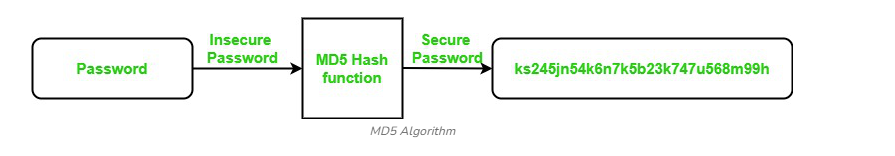

### Theory  

MD5 (**Message Digest Algorithm 5**) is a **cryptographic hash function** that produces a **fixed-size 128-bit hash value** from an input of **any length**. It is widely used to verify **data integrity** by generating a unique hash that can be compared against an original reference.  

However, due to **security vulnerabilities** like **collision attacks** (where two different inputs produce the same hash), MD5 is **no longer recommended** for secure cryptographic applications.  

  


#### Working of MD5 Algorithm  

The MD5 algorithm works by processing the input data in **512-bit blocks** and performs a series of transformations to generate a **128-bit hash**.  

#### Steps 

1. **Padding the Input**  
   - The message is padded so its length becomes congruent to 448 modulo 512.  
   - A single `1` bit is added followed by `0`s until the required length is reached.  

2. **Appending Message Length**  
   - The original length of the message (in bits) is appended as a **64-bit value** to the padded message, forming a multiple of **512 bits**.  

3. **Initialize MD5 Buffer**  
   - Four 32-bit variables are initialized:  
     - `A = 0x67452301`  
     - `B = 0xEFCDAB89`  
     - `C = 0x98BADCFE`  
     - `D = 0x10325476`  

4. **Processing Message in 512-bit Blocks**  
   - Each 512-bit block is divided into **16 words** of **32 bits** each.  
   - The algorithm performs **four rounds** of operations, each involving **16 steps**.  
   - Non-linear functions (`F`, `G`, `H`, `I`), bitwise operations, and predefined constants are applied in each step.  

5. **Output Generation**  
   - After all blocks are processed, the final hash is obtained by concatenating the variables:  
     ```
     MD5 = A || B || C || D
     ```  
   - The result is a **128-bit hash** represented as a **32-character hexadecimal string**.  


#### Use of MD5 Algorithm  

- **File Authentication** – Verify the authenticity and integrity of files by comparing generated MD5 hashes.  
- **Web Application Security** – Historically used to secure passwords before storage, though now considered insecure.  
- **Password Storage** – Earlier used for storing passwords as hashed values; replaced today by **SHA-256** and **bcrypt**.  
- **Data Integrity Checks** – Detect accidental data changes by comparing MD5 hashes before and after transmission.  


#### Applications of MD5 Algorithm  

- **File Integrity Verification** – Ensures that files remain unaltered by generating and comparing hash values.  
- **Digital Signatures** – Previously used for signing and verifying documents, now replaced by secure algorithms like **SHA-2**.  
- **Password Verification** – Historically used for matching login credentials by comparing hashed passwords.  
- **Gaming and Graphics** – Used in some engines to verify data consistency and prevent tampering.  
